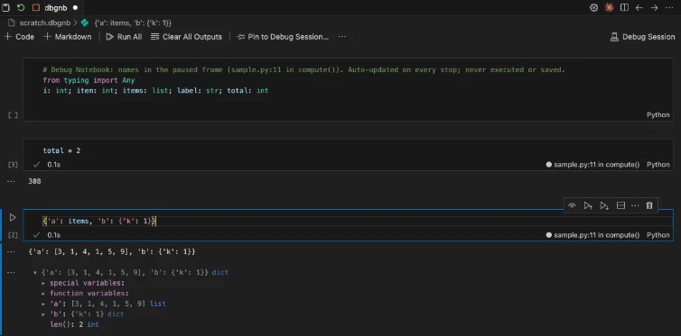
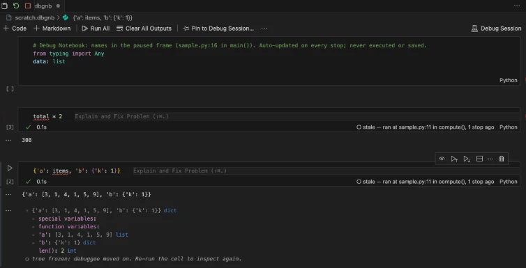
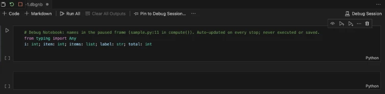
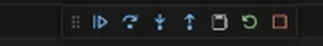
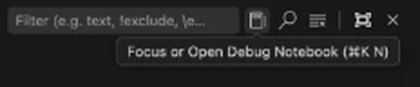
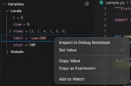

# Debug Notebook

A VS Code notebook whose "kernel" is the active debug session. Cells are evaluated in the currently selected stack frame of a paused process via the Debug Adapter Protocol `evaluate` request. No Jupyter, no kernel, no changes to how sessions are launched.

Design: [docs/design.md](docs/design.md). This is **Phase 1**: the generic MVP that works with any debug adapter.



After stepping, every output says which stop it came from; trees freeze once their variable references die:



A collapsed first cell declares the frame's names for the language server, so nothing is red and completions know the types:



Get there from the debug toolbar, the Debug Console title, `Cmd+K N`, or straight from the Variables view:

 



## What works

- `.dbgnb` notebook type, nbformat-4 compatible (rename to `.ipynb` to open elsewhere).
- Controller that sends cell source to the active session with `context: 'repl'`, targeting whatever frame is selected in the Call Stack view.
- stdout/stderr from the debuggee attributed to the running cell.
- Adapter errors rendered as error outputs.
- Per-cell status bar showing the frame the output came from and whether it is stale (the debuggee has stopped again since).
- Fast failure when the process is running instead of paused.
- Interrupt via DAP `cancel` when the adapter supports it.
- Commands: **Debug Notebook: Open Scratch Notebook**, **Debug Notebook: Re-run Stale Cells**.
- **Python (debugpy)**: a trailing expression renders as a rich MIME bundle (pandas `DataFrame` as an HTML table, anything with `_repr_html_`/`_repr_png_`/`_repr_mimebundle_`, IPython formatters when IPython is importable in the debuggee). Open matplotlib figures are captured as PNG after every cell and closed. End a cell with `;` to suppress the result. Results over `debugNotebook.python.maxBundleBytes` (10 MB) drop their largest items.
- Runtime completions from the adapter (`.` trigger) for the selected frame, ranked above language-server suggestions.
- **Variable tree**: the result object gets an expandable tree (lazy DAP `variables` requests, paged for big arrays). Trees freeze once the debuggee moves on, since variable references die on resume.
- **Watch cells**: toggle the eye icon on a cell and it re-runs on every stop, so a `df.head()` or a plot tracks stepping. Side effects repeat each time; the UI warns once.
- **Getting to the notebook**: notebook icon on the debug toolbar, in the Debug Console and Call Stack view titles, or `Cmd+K N` (`Ctrl+K N`) to focus it / bounce back to the editor. `debugNotebook.autoOpen` can open one on the first stop or at session start, with `autoOpenNotebook: lastUsed` reopening the last `.dbgnb` you used. A launch configuration can name its notebook: `"debugNotebook": "${workspaceFolder}/.vscode/inspect.dbgnb"` opens it (creating it if missing) pinned to that session.
- **Inspect from the Variables / Watch views**: right-click → **Inspect in Debug Notebook** appends and runs the item's expression, so a DataFrame in the Variables view becomes a table in one click.
- **Send selection**: `Cmd+Alt+Enter` (`Ctrl+Alt+Enter`) or the editor context menu sends the selection (or current line) to the debug notebook as a new cell, runs it, and moves the caret there.
- **Pinning**: the pin button in the notebook toolbar ties a notebook to a named session; unpinned notebooks follow the active one.
- **JavaScript (js-debug: Node, Chrome, Edge, extension host)**: cells keep the Debug Console's semantics (completion value of the last statement, assignments to locals persist, `let`/`const` do not outlive the cell). Objects get a collapsible JSON view, arrays of records an HTML table, functions their source, plus the variable tree. Completions use the whole cell.
- **No red squiggles**: a collapsed first cell declares the paused frame's names with types (`total: int; items: list; …`, or `var total, items;` for JS). The language server treats notebook cells as one module, so runtime names stop being "undefined" and get static completions. Refreshed on every stop and frame switch, never executed, never saved (`debugNotebook.scopeStub`).
- **`.ipynb` files**: pick **Debug Session** in the kernel picker of any Jupyter notebook to run its cells against the paused process. Nothing is written to the file by executing.

## Try it

```bash
npm install
npm run build
```

Then press F5 (**Run Extension**). The dev host opens the `fixtures/` folder.

Works the same in VS Code forks (Antigravity IDE, Cursor, VSCodium). From a shell, using Antigravity as the example:

```bash
"/Applications/Antigravity IDE.app/Contents/Resources/app/bin/antigravity-ide" --extensionDevelopmentPath="$PWD" "$PWD/fixtures"
```

If the IDE is already running, the currently focused window reloads as the dev host. If the packaged extension is also installed, add `--disable-extension=mrmobiustrip.debug-notebook` (the F5 config does), otherwise both copies load and toolbar buttons appear twice. `fixtures/scratch.dbgnb` is a ready-made notebook to open once paused.

Walkthrough:

1. Open `sample.py`, set a breakpoint on the `return total` line, start **Python: sample.py**.
2. Run **Debug Notebook: Open Scratch Notebook** from the command palette.
3. In a cell, run something multi-line, e.g.

   ```python
   for k, v in sorted(locals().items()):
       print(k, '=', v)
   ```

   Locals print as stdout; `total * 2` shows `200` as the result. Try

   ```python
   import pandas as pd, matplotlib.pyplot as plt
   df = pd.DataFrame({'i': range(len(items)), 'item': items, 'weighted': [x * (i + 1) for i, x in enumerate(items)]})
   plt.plot(df['weighted']); df
   ```

   if pandas/matplotlib are importable in the debuggee (`fixtures/.vscode/settings.json` decides which interpreter runs).

4. Click a different frame in the Call Stack view and re-run: the scope changes.
5. Step over a line: the cell status flips to `○ stale — ran at sample.py:11 in compute(), 1 stop ago`.

The same flow works with **Node: sample.js** under js-debug.

## Development

```bash
npm run typecheck
npm test          # vitest unit tests (vscode API mocked in test/vscode-mock.ts) + Python helper tests
npm run spike     # scripts/dap_spike.py: measures debugpy behaviours the Python profile relies on
npm run spike:js -- path/to/js-debug-dap/src/dapDebugServer.js   # same for js-debug
npm run watch
```

How the Python profile works, and what was measured against debugpy 1.8.20: `docs/design.md` §6 and the header of `src/profiles/PythonProfile.ts`.

## Layout

```
src/
  extension.ts            activation, commands
  session/
    SessionRegistry.ts    DebugAdapterTracker per session; stop state, capabilities, events
    TargetResolver.ts     picks (session, thread, frame) for an execution
    Dap.ts                typed customRequest wrappers
  notebook/
    Serializer.ts         .dbgnb <-> NotebookData (nbformat 4)
    Controller.ts         serial execution queue, interrupt, run metadata
    OutputRouter.ts       attributes DAP output events to the running cell
    Staleness.ts          pure staleness logic
    StatusBar.ts          cell status bar items
    Completions.ts        DAP completions provider
    VariableService.ts    answers the tree renderer's lazy variables requests
    WatchScheduler.ts     re-runs autoRun cells on every stop
  renderer/
    index.ts              variable tree renderer (webview bundle: dist/renderer.js)
    protocol.ts           renderer <-> extension messages
  profiles/
    LanguageProfile.ts    interface + session type -> language map
    GenericProfile.ts     plain evaluate; any adapter
    PythonProfile.ts      debugpy: helper injection, split/bundle, chunked fetch
    python/helper.py      injected into the debuggee as module __dbgnb (pure parse/format)
    JsProfile.ts          js-debug: eval wrapper keeps frame scope, helper formats the result
    js/helper.js          injected as globalThis.__dbgnb (JSON/table/function formatting)
fixtures/                 sample programs + launch configs for manual testing
scripts/dap_spike.py      standalone DAP client that probes debugpy
scripts/js_spike.py       same for js-debug (needs a js-debug-dap release: dapDebugServer.js)
test/                     vitest unit tests
```

## Ideas not done

- Chrome DOM previews beyond `outerHTML`; screenshots of canvases.
- Persisting scratch notebooks automatically per workspace.
